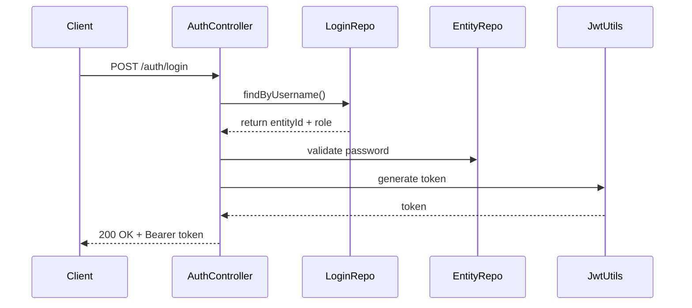

# 🔐 Auth Module – BookMyShow Backend

## ✅ Objective
Implement a secure, stateless authentication and authorization system with support for multi-role login (User, Vendor, Admin), JWT tokens, and zone-aware admin access control.

---

## 📁 Module Overview

| Component                  | Status        |
|---------------------------|---------------|
| User, Vendor, Admin Models| ✅ Done        |
| Login Credential Mapping  | ✅ Done        |
| JWT Utils & Config        | ✅ Done        |
| AuthServiceImpl           | ✅ Working     |
| AuthController            | ✅ Working     |
| Dev Data Seeder           | ✅ Working     |
| JWT Filter + Security     | ⏳ In Progress |
| Role-based Access (@PreAuth)| ⏳ Pending   |

---

## 🧱 Entity Overview

### `LoginUserCredRoleCheck`
- Centralized login table
- Fields: `username`, `password (BCrypt)`, `role`, `entityId`

### `AdminProfile`
- Separated admin entity
- Fields: `id`, `adminName`, `email`, `password`, `phoneNumber`, `adminIdNo`, `adminZone`, `createdByAdmin`

### `AdminZone`
- Hierarchical zone mapping (e.g., WORLD → US → US-CA → US-CA-LA)
- Fields: `zoneCode`, `name`, `level`, `parent`

---

## 🔐 Login Flow



# 🔐 Auth Module – Dev Seeder + API + Security + Extensions

---

## 🌱 Dev Seeder Highlights

Predefined admin profiles to bootstrap the system for testing and local development. Zone hierarchy-based creation is enforced for data integrity.

| Role Type      | Email                | Password | Zone         | Remarks        |
|----------------|----------------------|----------|--------------|----------------|
| Root Admin     | root@bms.com         | rootpass | WORLD        | Superadmin     |
| State Admin    | ca-admin@bms.com     | capass   | US-CA        | California     |
| State Admin    | ny-admin@bms.com     | nypass   | US-NY        | New York       |
| State Admin    | tx-admin@bms.com     | txpass   | US-TX        | Texas          |
| State Admin    | fl-admin@bms.com     | flpass   | US-FL        | Florida        |
| City Admin     | nyc-admin@bms.com    | nycpass  | US-NY-NYC    | NYC            |
| City Admin     | la-admin@bms.com     | lapass   | US-CA-LA     | Los Angeles    |
| City Admin     | sea-admin@bms.com    | seapass  | US-WA-SEA    | Seattle        |

> ℹ️ Seeder is invoked under `dev` profile using `CommandLineRunner`. Uses `AdminZoneRepository` to resolve zones before persisting.

---

## 📡 API Endpoints – Auth Module

| Method | Endpoint                    | Description                              | Secured |
|--------|-----------------------------|------------------------------------------|---------|
| POST   | `/auth/login`               | Login, returns JWT token                 | ❌      |
| POST   | `/auth/user/signup`         | Register a new user                      | ❌      |
| POST   | `/auth/vendor/signup`       | Register a new vendor                    | ❌      |
| POST   | `/api/v1/admin/create`      | Create a new admin under your zone       | ✅ Admin Only |

**Sample Request:**

```http
POST /api/v1/admin/create?creatorId=1
Authorization: Bearer <JWT_TOKEN>
Content-Type: application/json

{
  "adminName": "Florida Admin",
  "email": "florida-admin@bms.com",
  "password": "flpass123",
  "phoneNumber": "999-777-0001",
  "adminZoneCode": "US-FL"
}
```
## 🚀 Extension Ideas

- 🔄 **Refresh Token Support**  
  Implement refresh token mechanism alongside JWT access tokens to support long-lived sessions securely.

- 🔐 **Multi-Factor Authentication (MFA)**  
  Enforce OTP-based second-layer authentication for admins via email/SMS using Twilio or SendGrid.

- 🔐 **Login Rate Limiting & IP Auditing**  
  Throttle repeated login attempts with tools like Bucket4J or Spring RateLimiter. Track login IPs per user.

- 🌍 **SSO / OAuth2 Login**  
  Allow users/vendors to authenticate via Google or Facebook using Spring Security OAuth2 Client.

- 🎛️ **Admin Role Elevation Workflows**  
  Implement approval-based workflows to promote city-level admins to state-level or super admins.

- 🧾 **Login History & Audit Logs**  
  Maintain a log of login events, including timestamps, IPs, and device info for compliance & traceability.