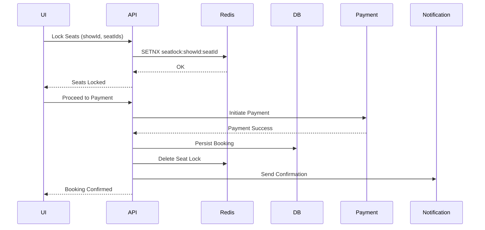
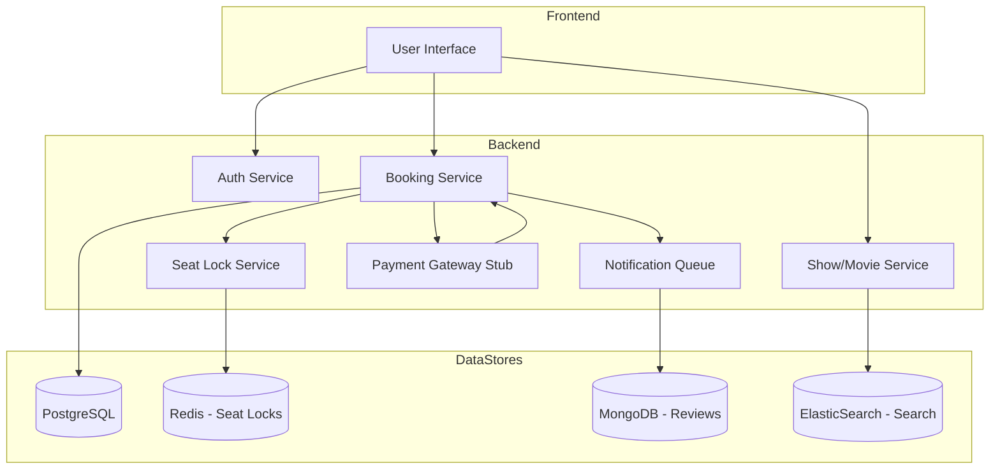

# 🎟️ BookMyShow Clone – Backend System Architecture

---

## 📌 1. Objective

Design and implement a scalable, fault-tolerant, and resource-efficient backend system for a BookMyShow-style ticket booking platform. The system should support real-time seat locking, high-concurrency booking, secure transactions, and dynamic content delivery for movies, concerts, and events.

---

## ✅ 2. Functional Requirements

* User registration, login, and JWT-based authentication
* City and theatre management
* Movie and show scheduling
* Real-time show search by city/date/movie
* Seat layout rendering for each show
* Seat locking with auto-expiry (5 minutes)
* Booking confirmation with payment integration
* Booking history per user
* Admin dashboard for movie/show/theatre management
* Review and rating submission for shows/movies
* Notifications via email/SMS

---

## 🔐 3. Non-Functional Requirements

| Requirement           | Value                  |
| --------------------- | ---------------------- |
| **Scalability**       | Handle 1M+ daily users |
| **High Availability** | 99.99% for booking API |
| **Latency**           | Seat lock under 100ms  |
| **Concurrency**       | Prevent overselling    |
| **Security**          | JWT, RBAC, encryption  |
| **Extensibility**     | Microservice-ready DDD |
| **Observability**     | Logs, metrics, alerts  |

---

## 📊 4. Traffic Estimates & SLA Targets

| Metric                     | Estimate |
| -------------------------- | -------- |
| Peak Concurrent Users      | 100,000  |
| Bookings/sec (peak sale)   | 10,000   |
| Seat Lock API Latency      | < 100ms  |
| Booking Completion SLA     | 99.95%   |
| Redis Seat Lock Uptime SLA | 99.99%   |

---

## 🌟 5. Use Cases

### User

* Register/Login
* Browse movies and shows
* View seat layout
* Lock seats
* Book tickets
* View past bookings

### Admin

* Add/edit/delete movies
* Configure theatres and screens
* Schedule shows
* View booking stats

### System

* Auto-expire stale seat locks
* Trigger async notifications
* Handle payment callbacks
* Reconcile bookings

---

## 🧱 6. System Modules

| Module           | Description                                     |
| ---------------- | ----------------------------------------------- |
| **Auth**         | JWT login, signup, role-based access            |
| **User**         | Profile, booking history                        |
| **City**         | CRUD operations for supported cities            |
| **Theatre**      | Theatre, screen, and seat setup                 |
| **Movie**        | CRUD movies with genre, language                |
| **Show**         | Create shows by mapping movie, screen, and time |
| **Booking**      | Seat selection, locking, booking finalization   |
| **Seat Lock**    | Redis-based locking mechanism with TTL          |
| **Payment**      | Mock/stub integration for payment processing    |
| **Notification** | Email/SMS alerts using async queues             |
| **Review**       | MongoDB-backed user reviews and ratings         |
| **Admin Panel**  | CMS interface for content management            |

---

## 🧹 7. Data Stores

| Database          | Usage                                                   |
| ----------------- | ------------------------------------------------------- |
| **PostgreSQL**    | Core relational entities (users, bookings, shows, etc.) |
| **Redis**         | In-memory TTL-based seat locks and cache                |
| **MongoDB**       | Flexible, schema-less reviews and user content          |
| **ElasticSearch** | Full-text show/movie search                             |

---

## 🔗 8. System Interfaces (APIs)

| Endpoint                | Description                     |
| ----------------------- | ------------------------------- |
| `POST /auth/login`      | Authenticate user, return JWT   |
| `GET /shows/{city}`     | Search available shows          |
| `POST /lockSeats`       | Lock requested seats in Redis   |
| `POST /bookSeats`       | Complete booking after payment  |
| `POST /payment/webhook` | Handle payment gateway response |
| `GET /bookings`         | List user booking history       |
| `POST /reviews`         | Add reviews to MongoDB          |

---

## 🧬 9. Sequence Diagram – Seat Lock and Booking

---

## ↺ 10. Data Flow Architecture Diagram

---

## ⚙️ 11. Tech Stack Summary

| Component          | Tech Stack                        |
| ------------------ | --------------------------------- |
| Language           | Java 17                           |
| Framework          | Spring Boot, Spring Data JPA      |
| Security           | Spring Security + JWT             |
| DB (Relational)    | PostgreSQL                        |
| DB (NoSQL)         | MongoDB                           |
| Caching & Locking  | Redis                             |
| Search Engine      | ElasticSearch                     |
| Messaging (future) | Kafka or RabbitMQ                 |
| DevOps             | Docker, GitHub Actions, Terraform |
| Monitoring         | Prometheus, Grafana, ELK Stack    |
| Docs               | Swagger / OpenAPI                 |

---

## 🚀 12. Future Enhancements

* Dynamic pricing for peak-hour shows
* Multi-region deployment with geo-routing
* Integration with real payment gateways (Razorpay, Stripe)
* Loyalty points & promotions engine
* Event-based notifications via Kafka
* Horizontal sharding of bookings
* Role-based admin dashboard (super admin, content team, ops)

---
